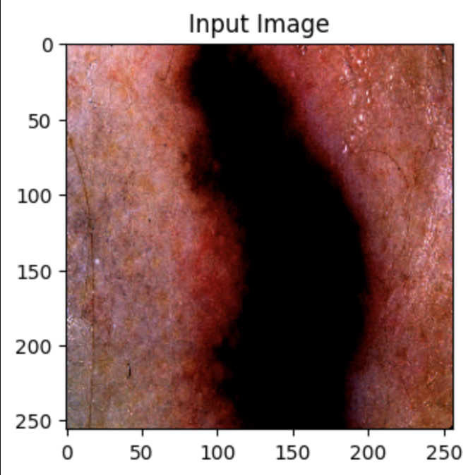
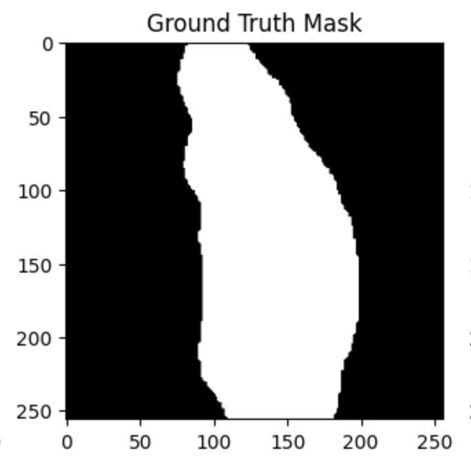
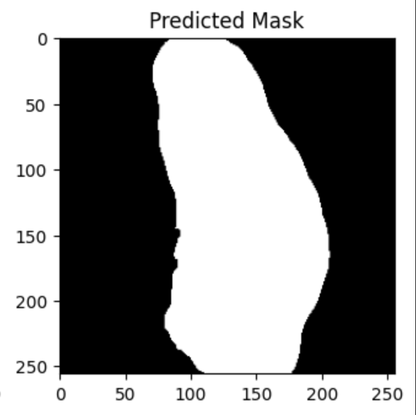

# 🧠 U-Net Skin Lesion Segmentation 🩺

This project implements a custom **U-Net convolutional neural network** for **semantic segmentation of skin lesions** using the **ISIC 2018 Challenge Dataset**. The goal is to automate lesion boundary detection in dermoscopic images — a critical step in early **melanoma diagnosis** and **clinical decision support**.

---

## 🧪 Project Overview

- **Model**: U-Net (fully convolutional, built from scratch in PyTorch)
- **Dataset**: ISIC 2018 - Task 1: Lesion Boundary Segmentation
- **Goal**: Generate binary segmentation masks for skin lesion areas
- **Framework**: PyTorch
- **Evaluation Metrics**: Dice Score (F1 for pixels), IoU (Jaccard Index)
- **Visualization**: Matplotlib (image comparisons + metric scores)

---

## 🧬 About ISIC 2018 Challenge

The **International Skin Imaging Collaboration (ISIC)** created the 2018 challenge to push innovation in AI-powered dermatology.  
**Task 1** focuses on **lesion boundary segmentation**, where models must predict binary masks that precisely outline skin lesions in dermoscopy images.

📁 Dataset: [https://challenge.isic-archive.com/](https://challenge.isic-archive.com/)  
🗂️ Image Resolution: 256x256 (resized from original)  
📌 Ground Truth: Pixel-wise binary masks (white = lesion, black = background)

---

## 📸 Visual Results

| Input Image       | Ground Truth Mask     | Predicted Mask         |
|-------------------|-----------------------|-------------------------|
|  |  |  |

> *Above: The predicted segmentation closely aligns with the annotated ground truth.*

---

## 📊 Evaluation Metrics

After training for just **5 epochs**, the model achieved the following:

- ✅ **Average Dice Score**: `0.8494`
- ✅ **Average IoU Score**: `0.7480`

These scores reflect strong overlap between predicted masks and annotated lesion regions, demonstrating clinical-grade segmentation performance.

---

## 🧠 U-Net Architecture & Model Implementation

The core of this project is a custom-built **U-Net architecture**, a fully convolutional network that is highly effective in biomedical image segmentation due to its balance of localization and context.

### 🧱 Architecture Overview

- **Encoder (Contracting Path)**:
  - 2D convolutions → ReLU → MaxPooling
  - Captures high-level features while downsampling input
- **Bottleneck**:
  - Deepest layer with the most abstract representation
- **Decoder (Expanding Path)**:
  - Transposed Convolutions → Concat with Encoder → Convolutions
  - Upsamples to original image size while recovering fine details
- **Skip Connections**:
  - Transfers spatial information from encoder to decoder
  - Improves boundary precision and segmentation sharpness

### 🔧 My Custom Implementation (PyTorch)

- Built the U-Net from scratch using only `torch.nn` modules
- Reshaped data to ensure compatibility between masks and model output
- Used `BCEWithLogitsLoss` for binary segmentation loss
- Predicted masks thresholded with 0.5 for clean binary output

---

## 🏋️ Training Details

- **Framework**: PyTorch
- **Hardware**: GPU (Google Colab, CUDA-enabled)
- **Loss Function**: Binary Cross Entropy with Logits
- **Optimizer**: Adam (learning rate: 1e-4)
- **Batch Size**: 8 (train), 4 (validation)
- **Epochs**: 5 (but scales well with more)

---

## 🧠 Why It Works

- 🔬 **Skip Connections** preserve lesion edge information
- ⚖️ **Encoder-Decoder symmetry** balances context and detail
- 🔁 **Batch-wise augmentation** improves generalization
- 📈 **Metric feedback (Dice/IoU)** helps evaluate clinical accuracy

---

## 🧰 Real-World Applications

This model has high potential for integration into:

- 💻 **AI-assisted diagnostic tools** in dermatology
- 📱 **Mobile apps** for early skin cancer detection in underserved regions
- 🧪 **Clinical research workflows** to reduce manual segmentation labor

---

## 🚀 Getting Started

### 1. Clone the Repo

```bash
git clone https://github.com/riantiwari/unet-skin-lesion-segmentation.git
cd unet-skin-lesion-segmentation
```

### 2. Install Dependencies

```bash
pip install -r requirements.txt
```

### 3. Run the Notebook

You can either:
- Run it in Jupyter Notebook locally
- Or use [Google Colab](https://colab.research.google.com/) and upload the `.ipynb` file

---

## 📁 File Structure

```
├── UNet_Implementation_Rian_Tiwari.ipynb     # Main notebook
├── requirements.txt                          # Python dependencies
├── README.md                                 # You're here
└── assets/                                   # (Optional) Folder for visual results
    ├── input_img.png
    ├── gt_img.png
    └── pred_img.png
```

---

## 🤝 Credits

- **ISIC Challenge 2018** – for providing the dermoscopy dataset
- **U-Net Paper** – Olaf Ronneberger et al., 2015  
- **Streamlit / TorchMetrics** – for expanding this project into future real-time apps

---

## 💡 Future Work

- Integrate with **Streamlit** for real-time image upload & prediction  
- Test on **other ISIC challenge years** for cross-dataset performance  
- Add **data augmentation** and **more training epochs** for higher accuracy  
- Deploy to Hugging Face Spaces or a Dockerized API

---

## 🔗 Let's Connect

Built with 💻 + ❤️ by [@riantiwari](https://github.com/riantiwari)  
Drop a ⭐ if this helps your journey in medical AI!
